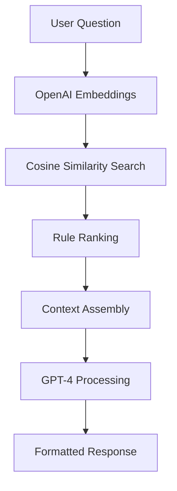

# Architecture Guide - HeyBLU AI

This document explains the technical architecture, design decisions, and system structure of HeyBLU AI.

## 🏗️ System Overview

HeyBLU AI is a serverless web application that provides instant, AI-powered baseball rule answers. The system combines semantic search, natural language processing, and a Progressive Web App (PWA) to deliver accurate rule citations in real-time.

### High-Level Architecture

```
┌─────────────────┐    ┌─────────────────┐    ┌─────────────────┐
│   User Device   │    │   Vercel CDN    │    │   OpenAI API    │
│   (PWA/Web)     │◄──►│   (Static)      │◄──►│   (AI/ML)       │
└─────────────────┘    └─────────────────┘    └─────────────────┘
         │                       │
         │                       │
         ▼                       ▼
┌─────────────────┐    ┌─────────────────┐
│   Vercel Edge   │    │   PostgreSQL    │
│   Functions     │◄──►│   (Optional)    │
└─────────────────┘    └─────────────────┘
```

## 🎯 Design Principles

### 1. Performance First
- **Serverless Architecture**: Automatic scaling and zero cold start overhead
- **Edge Computing**: Vercel Edge Functions for global performance
- **CDN Distribution**: Static assets served from global CDN
- **Minimal Dependencies**: Vanilla JavaScript for maximum performance

### 2. User Experience
- **Progressive Web App**: Native app-like experience
- **Offline Capability**: Core functionality works without internet
- **Voice Input**: Hands-free operation for coaches and umpires
- **Instant Responses**: Sub-second answer delivery

### 3. Accuracy & Reliability
- **Semantic Search**: AI-powered rule matching
- **Fallback Logic**: Multiple rulebook references
- **Citation Tracking**: Official rule references
- **Feedback Loop**: Continuous improvement through user feedback

### 4. Scalability
- **Stateless Functions**: Horizontal scaling capability
- **Database Optional**: Works without persistent storage
- **Modular Design**: Easy to add new leagues and features

## 📁 File Organization Rationale

### Root Directory Structure

```
hey-blu-ai/
├── api/                    # Serverless API functions
├── rulebook/              # Main PWA application
├── pitchdeck/             # Investor materials
├── dist/                  # Compiled output
├── src/                   # Source files
├── images/                # Static assets
└── config files           # Build and deployment configs
```

### Why This Structure?

1. **`api/` Directory**
   - **Purpose**: Contains all serverless functions
   - **Rationale**: Vercel automatically detects and deploys functions in this directory
   - **Benefits**: Clear separation of backend logic, easy to manage

2. **`rulebook/` Directory**
   - **Purpose**: Main PWA application
   - **Rationale**: Self-contained PWA with its own manifest and service worker
   - **Benefits**: Can be deployed independently, clear user-facing interface

3. **`pitchdeck/` Directory**
   - **Purpose**: Investor and presentation materials
   - **Rationale**: Separate from main app to avoid confusion
   - **Benefits**: Easy to update without affecting core functionality

4. **`dist/` Directory**
   - **Purpose**: Compiled TypeScript and CSS output
   - **Rationale**: Separation of source and compiled code
   - **Benefits**: Clean builds, easy deployment

## 🔧 Technical Stack Decisions

### Frontend Technology Choices

#### Why Vanilla JavaScript?
- **Performance**: No framework overhead
- **Bundle Size**: Minimal JavaScript footprint
- **Compatibility**: Works on all devices and browsers
- **Maintenance**: Easier to debug and maintain
- **PWA Support**: Better service worker integration

#### Why Tailwind CSS?
- **Utility-First**: Rapid development and consistent design
- **Responsive Design**: Built-in mobile-first approach
- **Customization**: Easy to extend and modify
- **Performance**: Only includes used styles in production
- **Maintenance**: Easier to maintain than custom CSS

#### Why PWA Instead of Native App?
- **Cross-Platform**: Single codebase for all platforms
- **Distribution**: No app store approval process
- **Updates**: Instant updates without user intervention
- **Cost**: Lower development and maintenance costs
- **Web Standards**: Leverages existing web technologies

### Backend Technology Choices

#### Why Vercel Functions?
- **Serverless**: No server management required
- **Auto-scaling**: Handles traffic spikes automatically
- **Global Edge**: Functions run close to users
- **Developer Experience**: Excellent tooling and deployment
- **Cost**: Pay only for usage

#### Why Node.js?
- **JavaScript**: Same language as frontend
- **Ecosystem**: Rich package ecosystem
- **Performance**: Good for I/O intensive operations
- **Community**: Large developer community
- **Vercel Support**: First-class support on Vercel

#### Why OpenAI API?
- **State-of-the-Art**: Best available language models
- **Embeddings**: High-quality semantic search
- **Reliability**: Enterprise-grade service
- **Cost**: Reasonable pricing for usage
- **Integration**: Easy to integrate and scale

## 🧠 AI/ML Architecture

### Semantic Search Pipeline



### Embedding Strategy

1. **Rule Preprocessing**
   - Split rulebooks into semantic chunks
   - Generate embeddings for each chunk
   - Store embeddings with rule metadata

2. **Query Processing**
   - Generate embedding for user question
   - Calculate cosine similarity with all rule embeddings
   - Select top 10 most similar rules

3. **Context Assembly**
   - Combine selected rules into context
   - Include conversation history if available
   - Add league-specific instructions

### Fallback Logic

```javascript
// Simplified fallback logic
if (primaryLeagueRules.length === 0 || 
    allRulesContainFallbackIndicators(primaryLeagueRules)) {
  
  const fallbackLeague = getFallbackLeague(primaryLeague);
  const fallbackRules = searchFallbackRules(question, fallbackLeague);
  
  return generateResponseWithFallback(
    question, 
    fallbackRules, 
    primaryLeague, 
    fallbackLeague
  );
}
```

## 🔄 Data Flow Architecture

### Question Processing Flow

1. **User Input**
   - Text input or voice recognition
   - League selection
   - Conversation context

2. **API Processing**
   - Input validation
   - League-specific rule selection
   - Semantic search execution
   - Fallback logic application

3. **AI Processing**
   - Context assembly
   - GPT-4 prompt construction
   - Response generation
   - Citation extraction

4. **Response Delivery**
   - Formatted answer
   - Rule citations
   - Disclaimer information
   - Feedback collection

### State Management

```javascript
// Client-side state structure
const appState = {
  conversation: [
    {
      user: "What is the infield fly rule?",
      ai: "The infield fly rule applies when...",
      league: "MLB",
      shortUrl: "https://heyblu.ai/r/abc123",
      feedbackStatus: null,
      usedFallback: false
    }
  ],
  currentLeague: "MLB",
  isProcessing: false
};
```

## 🎨 Design System Architecture

### Component Structure

#### Visual Components
- **Header**: Navigation and branding
- **Question Form**: Input and league selection
- **Answer Display**: Formatted responses with citations
- **Feedback System**: Thumbs up/down and text feedback
- **Share System**: URL generation and sharing

#### Interaction Patterns
- **Progressive Enhancement**: Works without JavaScript
- **Graceful Degradation**: Falls back when features unavailable
- **Accessibility First**: Screen reader and keyboard navigation
- **Mobile First**: Touch-friendly interface design

### CSS Architecture

```css
/* Base styles */
body { /* Global styles */ }

/* Component styles */
.container { /* Layout components */ }
.btn { /* Button components */ }
.answer-box { /* Answer display */ }

/* Utility classes */
.text-center { /* Tailwind utilities */ }
.mb-4 { /* Spacing utilities */ }

/* Custom animations */
@keyframes pulse-intro { /* Custom animations */ }
```

## 🔌 Integration Points

### External Services

#### OpenAI Integration
```javascript
// Embeddings API
const embeddings = await fetch('https://api.openai.com/v1/embeddings', {
  method: 'POST',
  headers: {
    'Authorization': `Bearer ${process.env.OPENAI_API_KEY}`,
    'Content-Type': 'application/json'
  },
  body: JSON.stringify({
    model: 'text-embedding-3-small',
    input: question
  })
});

// Chat Completions API
const completion = await fetch('https://api.openai.com/v1/chat/completions', {
  method: 'POST',
  headers: {
    'Authorization': `Bearer ${process.env.OPENAI_API_KEY}`,
    'Content-Type': 'application/json'
  },
  body: JSON.stringify({
    model: 'gpt-4o',
    messages: [{ role: 'user', content: prompt }],
    temperature: 0.4
  })
});
```

#### Database Integration (Optional)
```javascript
// PostgreSQL connection
const { Client } = require('pg');
const client = new Client({ connectionString: process.env.DATABASE_URL });

// Question logging
await client.query(
  'INSERT INTO question_logs (question, answer, rule_ref, rulebook, created_at) VALUES ($1, $2, $3, $4, NOW())',
  [question, reply, ruleRef, leagueName]
);
```

#### Form Handling
```html
<!-- Formspree integration -->
<form action="https://formspree.io/f/mjkrezok" method="POST">
  <!-- Form fields -->
</form>
```

### Internal Dependencies

#### Service Worker
```javascript
// PWA functionality
self.addEventListener('fetch', event => {
  // Cache strategies
});

self.addEventListener('install', event => {
  // App installation
});
```

#### URL Shortening
```javascript
// Internal API for sharing
const shortUrl = await fetch('/api/shorten', {
  method: 'POST',
  body: JSON.stringify({
    question: question,
    answer: answer,
    league: league
  })
});
```

## 🚀 Performance Architecture

### Caching Strategy

1. **Static Assets**
   - CDN caching for images and CSS
   - Long-term caching with versioning
   - Gzip compression

2. **API Responses**
   - No caching for dynamic content
   - Rate limiting for API protection
   - Error handling and retries

3. **PWA Caching**
   - Service worker for offline functionality
   - Cache-first strategy for static assets
   - Network-first for API calls

### Optimization Techniques

1. **Bundle Optimization**
   - Minimal JavaScript footprint
   - Tree shaking for unused code
   - Code splitting for large features

2. **Image Optimization**
   - WebP format for modern browsers
   - Responsive images for different screen sizes
   - Lazy loading for below-the-fold content

3. **Network Optimization**
   - HTTP/2 for multiplexing
   - Preconnect to external domains
   - Resource hints for critical resources

## 🔒 Security Architecture

### API Security

1. **CORS Configuration**
   ```javascript
   const allowedOrigins = [
     'https://heyblu.ai',
     'https://www.heyblu.ai'
   ];
   ```

2. **Input Validation**
   ```javascript
   if (!question || typeof question !== 'string' || question.length > 1000) {
     return res.status(400).json({ error: 'Invalid question' });
   }
   ```

3. **Rate Limiting**
   ```javascript
   // Implement rate limiting per IP
   const rateLimit = new Map();
   const RATE_LIMIT = 100; // requests per hour
   ```

### Data Protection

1. **No Sensitive Data Storage**
   - No user personal information stored
   - No authentication required
   - Anonymous usage only

2. **API Key Protection**
   - Environment variables only
   - Never exposed to client
   - Rotated regularly

3. **HTTPS Everywhere**
   - All traffic encrypted
   - HSTS headers
   - Secure cookies only

## 📊 Monitoring Architecture

### Error Tracking

1. **Function Logs**
   ```javascript
   console.error('API Error:', error);
   console.error('Error details:', error.message);
   ```

2. **User Feedback**
   ```javascript
   // Collect user feedback for improvement
   const feedback = {
     question: userQuestion,
     answer: aiResponse,
     feedbackType: 'positive' | 'negative',
     feedbackText: userComment
   };
   ```

3. **Performance Monitoring**
   - Vercel Analytics for performance metrics
   - Custom events for user interactions
   - Error rate monitoring

### Analytics Strategy

1. **Usage Analytics**
   - Question frequency by league
   - Popular question types
   - User engagement metrics

2. **Performance Analytics**
   - API response times
   - Error rates
   - User satisfaction scores

3. **Business Analytics**
   - League request trends
   - Feature usage patterns
   - Conversion metrics

## 🔮 Future Architecture Considerations

### Scalability Improvements

1. **Database Scaling**
   - Read replicas for analytics
   - Partitioning by league
   - Caching layer (Redis)

2. **API Scaling**
   - Function concurrency limits
   - Queue system for high volume
   - Regional deployment

3. **Content Scaling**
   - Dynamic rulebook updates
   - A/B testing framework
   - Feature flags

### Technology Evolution

1. **AI Model Updates**
   - Newer OpenAI models
   - Custom fine-tuned models
   - Local model deployment

2. **Frontend Evolution**
   - Framework migration if needed
   - Web Components
   - Advanced PWA features

3. **Backend Evolution**
   - Microservices architecture
   - Event-driven design
   - Real-time updates

---

This architecture provides a solid foundation for HeyBLU AI while remaining flexible enough to evolve with changing requirements and technologies.
