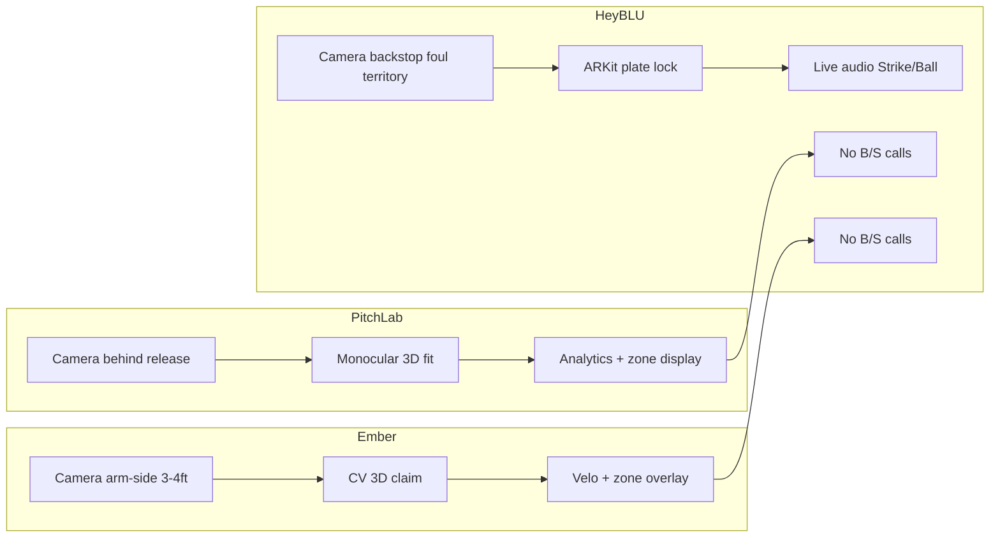

# HeyBLU — Competitive Comparison Research Report

**Document type:** LLM research deliverable (per `HEYBLU_COMPETITIVE_COMPARISON_RESEARCH_BRIEF.md` §12.2)  
**Prepared:** May 24, 2026  
**Research focus:** App Store adjacency + SEO comparison opportunities  
**Status:** Draft for human review — not published web copy  

**Sources:** Vendor sites, App Store listings, MLB/Hawk-Eye public materials, Driveline patent filing, pitch deck modality taxonomy. All competitor facts cited below; HeyBLU product claims verified against heyblu.ai/faq and field-guide only.

---

## Product taxonomy (HeyBLU team input — use for all comparisons)

HeyBLU occupies a narrow but defensible niche: **live ball/strike calls on taken pitches** using **plate-anchored 3D geometry** from an **offset backstop mount** (foul territory, 10–15 ft from plate).

| Bucket | What they actually do | True overlap with HeyBLU live B/S? |
|--------|----------------------|-------------------------------------|
| **A — Multi-camera optical hardware (RECON, stadium ABS)** | Triangulated 3D ball flight; **dedicated camera rigs** — not phone apps. “Portable” (e.g. RECON) means carryable to the field, not pocketable; likely **10–50+ lb class** (weight unverified publicly) | **High** on tracking/officiating *capability*; **None** on App Store adjacency |
| **B — Phone pitch analytics (PitchLab, Ember)** | Monocular CV + physics/math; primary job = velo/movement/video analytics. **No live ball/strike audio calls** (team-confirmed; not in vendor marketing) | **Low** — zone overlay / location metrics only; release-side camera, not plate-locked umpire geometry |
| **C — Manual zone charting / command grids** | Human taps intended/actual location (Bullpen Pro, Zone Traxx, Pocket Radar tagging, Driveline Intended Zones + TrackMan) | **Medium** on command-training intent; **Low** on automated B/S |
| **D — Velocity-only / smart ball / lab radar** | Pocket Radar, pitchLogic, TrackMan, Rapsodo | **Low** on zone calls; **High** on “pitching tech” App Store browse |
| **E — App Store keyword noise** | Umpire clickers, pitch counters, scorekeepers | **None** on tracking — but **High** on shared search results |

**Key technical distinction for Bucket B:** PitchLab and Ember both market “3D” tracking and strike-zone **visualization**, but **neither offers live ball/strike calls** (no umpire-style Strike/Ball audio or adjudication on taken pitches). Public materials indicate **monocular trajectory reconstruction** from a **pitcher-side or release-adjacent camera**, then **extrapolation** to plate crossing — not ARKit plate lock from a backstop offset view.

**HeyBLU’s wedge:** **physical plate anchor + foul-territory mount + live audio Strike/Ball on taken pitches** — likely the only **phone app** in this set with that job (hardware peers: RECON, ABS; see Bucket A).

---

## 1. Executive summary — top 10 comparison pages to build first

Prioritized for **App Store adjacency** (who appears beside HeyBLU in search) and **honest winnability** on portable live ball/strike.

| Rank | Page slug | Primary query / App Store keyword | Intent fit | Honest win | Est. volume | Difficulty | Rationale |
|------|-----------|--------------------------------|------------|------------|-------------|------------|-----------|
| 1 | `pitchlab` | PitchLab, pitch tracker iPhone, baseball pitching metrics | High | **Highest** | Medium | Medium | Closest App Store look-alike (iPhone + tripod) but **no B/S calls** — analytics only ([pitchlab.app](https://pitchlab.app/)) |
| 2 | `ember-pitching-analyzer` | Ember pitching, 3D pitch tracking app | High | **Highest** | Low–Med | Low | Zone **visualization** only, **no B/S calls**; $12.99/mo; arm-side mount ([embersports.com/pitching-analyzer/](https://embersports.com/pitching-analyzer/)) |
| 3 | `automated-strike-zone-app` | automated strike zone app, ball strike caller | **Highest** | **Highest** | Med | Med | Intent page; HeyBLU likely **only phone app** with live B/S — PitchLab/Ember show zone, don’t call it |
| 4 | `bullpen-pro` | bullpen command app, pitch location tracker | High | High | Low | Low | Manual 5×5 grid command scoring — App Store “You Might Also Like” cluster ([App Store](https://apps.apple.com/us/app/bullpen-pro/id6762027944)) |
| 5 | `zone-traxx` | baseball strike zone app, pitch charting | Medium | Med | Med | Med | Ranks for “strike zone”; manual in-game charting, bullpen mode listed ([zonetraxx.com](https://zonetraxx.com/)) |
| 6 | `pocket-radar` | Pocket Radar command, pitch tagging charting | Medium | High | Med | Med–High | PLUS pitch tagging = manual location per pitch; requires $300+ hardware ([pocketradar.com/pages/plus](https://www.pocketradar.com/pages/plus)) |
| 7 | `driveline-intended-zones` | command training baseball, intended zones | Medium | High | Low | Low | Same command-training job as HeyBLU Calibrate; needs TrackMan + plate touchscreen ([Driveline blog](https://www.drivelinebaseball.com/2025/08/how-intended-zones-helped-janson-junk-and-stefan-raeth-to-breakout-seasons/)) |
| 8 | `baseball-umpire-apps` | baseball umpire app, umpire clicker | Low (conversion) | High (clarity) | Med | Low | **Disambiguation page** — explains clickers ≠ zone tracking; reduces bounce from wrong intent |
| 9 | `smartpitch` | pitch speed app iPhone | Medium | Med | Med | Med | App Store velocity peer; no B/S ([smartpitchbaseball.com](https://www.smartpitchbaseball.com/app-function)) |
| 10 | `recon-magnus` | portable pitch tracker, Yakkertech alternative | Low (App Store) | High (web) | Low | Low | **Web SEO Phase 2** — dual-camera **hardware rig** (~10–50+ lb est.), not a phone; $10,500 ([seemagnus.com/recon](https://www.seemagnus.com/recon)) |

**Deprioritize for Phase 1 (web SEO / not App Store peers):** `mlb-abs-hawk-eye`, TrackMan, Rapsodo, pitchLogic, GameChanger — valuable for “alternative” and ABS-culture searches, not App Store browse.

---

## 2. Master competitor list

| Name | URL | Category | Price (public) | Platform | Primary job | Overlap (1–5) | Dedicated page? |
|------|-----|----------|----------------|----------|-------------|---------------|-----------------|
| **HeyBLU** | heyblu.ai | Phone + AR plate-lock B/S | TBD (beta) | iOS only | Live audio ball/strike, assistive umpire | — | — |
| **PitchLab** | [pitchlab.app](https://pitchlab.app/) / [App Store](https://apps.apple.com/us/app/pitchlab-baseball-softball/id6738223162) | Phone CV analytics | Free; Pro ~$24.99/mo | iOS | Velo, break, spin, video tracer — **no B/S calls** | 3 | **Y** |
| **Ember Pitching Analyzer** | [embersports.com](https://embersports.com/pitching-analyzer/) / [App Store](https://apps.apple.com/us/app/ember-pitching-analyzer/id6744611076) | Phone CV analytics | **$12.99/mo** (7-day trial); **$119.99/yr** | iOS (iPad) | Velo, trajectory, zone **visualization** — **no B/S calls** | 3 | **Y** |
| **SmartPitch** | [smartpitchbaseball.com](https://www.smartpitchbaseball.com/app-function) / [App Store](https://apps.apple.com/us/app/smartpitch-hands-free-speeds/id1227184298) | Phone CV speed | ~$4.99/mo–$39.99 lifetime | iOS + Android | Pitch/hit speed, LA, EV; no auto B/S | 2 | Maybe |
| **Bullpen Pro** | [App Store](https://apps.apple.com/us/app/bullpen-pro/id6762027944) | Manual command charting | Free; Coach $3.99/mo | iOS | 5×5 grid tap, command score, heatmaps | 3 | **Y** |
| **Zone Traxx** | [zonetraxx.com](https://zonetraxx.com/) / [App Store](https://apps.apple.com/tt/app/zone-traxx/id1516553308) | Manual game charting | Tracker $19.99/mo or $119.99/yr | iOS | In-game pitch charting, heatmaps | 3 | **Y** |
| **Pocket Radar Sports** | [pocketradar.com](https://www.pocketradar.com/pages/plus) / [App Store](https://apps.apple.com/us/app/pocket-radar-sports/id1576214627) | Radar + app | Smart Coach ~$300+ device; PLUS sub | iOS + Android | Doppler velocity; PLUS pitch tagging | 3 | **Y** |
| **Driveline Intended Zones** | [Driveline](https://www.drivelinebaseball.com/training/pitching/) / [patent](https://www.patents-review.com/a/20250242201-intended-zone-tracker.html) | Command training system | PLUS membership + hardware | Web/app + TrackMan | Intent target at plate + tracked result | 3 | **Y** |
| **Magnus RECON** | [seemagnus.com/recon](https://www.seemagnus.com/recon) | **Hardware** dual-camera rig (not phone) | $10,500 USD | Web app + **carryable rig** | Full pitch/hit metrics, spin, movement | 4 (3D tracking) / 0 (App Store) | **Y** (web Phase 2) |
| **MLB ABS (Hawk-Eye)** | [MLB explainer](https://www.mlb.com/interactive/mlb-abs-system-explainer) | Stadium 12-camera | League infrastructure | N/A | Challenge-system B/S verification | 5 (officiating) / 1 (portable) | **Y** |
| **Yakkertech Sentinel** | [seemagnus.com/yakkertech](https://www.seemagnus.com/yakkertech) | 4-camera install | ~$10k–$20k+ (est.) | Cloud + apps | Pro/amateur full tracking | 4 | Maybe |
| **TrackMan Baseball** | trackman.com | Radar + vision | $10k–$100k+ | Facility | Lab-grade metrics | 3 | Y (Phase 2) |
| **Rapsodo PRO 3.0** | [rapsodo.com](https://rapsodo.com/products/rapsodo-pro-3-ball-flight-monitor) | Camera + radar cage unit | $8,500 (MSRP; reseller variance) | iOS/Android app | Spin, movement, zone recognition | 3 | Y (Phase 2) |
| **pitchLogic** | [pitchlogic.com](https://pitchlogic.com/baseball) | Smart ball IMU | Ball + app (no sub for base metrics) | iOS + Android | Spin, movement; heatmaps not live B/S | 2 | Maybe |
| **GameChanger** | [gc.com](https://gc.com/) | Scorekeeping | Freemium | iOS + Android | Manual B/S, pitch count, Pocket Radar velo | 2 | Maybe |
| **Pitch Tracker Pro** | [pitchtrackerpro.com](https://pitchtrackerpro.com/) | Phone biomechanics | Subscription (trial) | iOS + Android | Real-time pitch detect, 3D body AR | 2 | Maybe |
| **Ball Strike Clicker** | [App Store](https://apps.apple.com/us/app/ball-strike-clicker-baseball/id519635218) | Umpire clicker | Free | iOS | Count balls/strikes manually | 1 | Intent only |
| **Umpire Indicator Pro** | [App Store](https://mwm.ai/apps/umpire-indicator-pro/1222457137) | Umpire clicker | Freemium | iOS | Digital indicator | 1 | Intent only |
| **iUmpire Elite** | [App Store](https://apps.apple.com/us/app/iumpire-elite/id427428222) | Umpire clicker + extras | Free | iOS | Clicker, pitch counter, approx “radar” | 1 | Intent only |
| **Athla Velocity** | Legacy phone speed | ~$11.99–$29.99 | iOS | MPH from video | 1 | No |
| **HitTrax** | Facility optical | $10k+ class | PC | Cage sim + tracking | 2 | Phase 3 |

*Overlap score: 5 = same core job (live plate crossing / officiating); 1 = keyword adjacency only.*

---

## 3. Search intent map

| Keyword cluster | Est. intent | Recommended page title | Primary competitor(s) | HeyBLU angle |
|-----------------|-------------|------------------------|----------------------|---------------|
| pitchlab / pitch lab app | Compare phone pitch trackers | HeyBLU vs PitchLab: Live Ball-Strike Calls vs Pitch Analytics | PitchLab | **Only HeyBLU does live B/S calls**; PitchLab = metrics + zone display, behind-release mount |
| ember pitching analyzer / ember 3d pitch | New CV app evaluation | HeyBLU vs Ember: Umpire Calls vs Zone Visualization | Ember | **No B/S calls on Ember**; $12.99/mo; arm-side analytics vs backstop plate anchor |
| automated strike zone app | **Buy** assistive zone tool | Best Automated Strike Zone Apps for Youth Baseball (2026) | HeyBLU (+ honest “analytics only” apps) | HeyBLU may be only **phone app** with live calls; note RECON/ABS are **hardware**, not App Store |
| ball strike caller app | **Buy** audio feedback | iPhone Ball Strike Caller Compared | HeyBLU, (few others) | Real-time audio on taken pitches |
| baseball strike zone app | Mixed: charting + training | HeyBLU vs Zone Traxx: Automatic Calls vs Manual Charting | Zone Traxx, Bullpen Pro | Auto detection vs tap-to-chart |
| bullpen command app / command training | Coach training workflow | Command Training: HeyBLU vs Bullpen Pro vs Driveline | Bullpen Pro, Driveline IZ, Pocket Radar PLUS | Intent zone + auto result when trajectory trusted |
| pocket radar command / pitch tagging | Radar owners wanting location | HeyBLU vs Pocket Radar: Zone Calls vs Velocity + Manual Tags | Pocket Radar | Sensor-class velo vs vision B/S; no MPH parity claims |
| trackman alternative / cheap trackman | Price shopping lab gear | TrackMan Alternative for Little League Bullpens | Rapsodo, PitchLab, HeyBLU (+ RECON hardware) | Phone + tripod vs $8.5k–$100k+ lab gear; RECON is carryable **rig**, not phone |
| ABS little league / robot umpire youth | League policy curiosity | Youth ABS vs Phone Assistive Zone (HeyBLU) | MLB ABS | Training assist, not MLB challenge system |
| baseball umpire app | **Wrong intent** (clicker) | Baseball Umpire Apps: Clickers vs Strike Zone Trackers | Umpire Indicator, Ball Strike Clicker | Disambiguation → HeyBLU for objective zone |
| rapsodo alternative | Cage facility buyer | HeyBLU vs Rapsodo: Outdoor Bullpen vs Cage Lab | Rapsodo PRO 3.0 | No spin axis; portable field |
| pitchlogic alternative | Smart ball shopper | HeyBLU vs pitchLogic: Any Ball vs Sensor Ball | pitchLogic | Regulation ball, no special ball |
| gamechanger pitch count | League scorer | HeyBLU + GameChanger: Zone Feedback Alongside Scorekeeping | GameChanger | Complement, not replace scorer |

---

## 4. Tier A deep dives

### 4.1 PitchLab

**Sources:** [pitchlab.app](https://pitchlab.app/) (accessed 2026-05-24), [App Store](https://apps.apple.com/us/app/pitchlab-baseball-softball/id6738223162), [Devpost](https://devpost.com/software/pitchlab) (accessed 2026-05-24)

| | |
|--|--|
| **Features** | iPhone 12+, iOS 17+; tripod **behind release point**; calibrate home plate in app; velo, IVB/HB, active spin, spin axis; ball tracer, auto-trim video, CSV export (Pro). Devpost: custom CNN + physics engine for **3D trajectory from single camera**. |
| **Pricing** | Free (25 throws/mo); Pro $24.99/mo; Team custom ([pitchlab.app](https://pitchlab.app/)) |
| **Buyer** | Individual pitchers, private coaches, facilities wanting Rapsodo-like data without hardware |
| **Live B/S calls?** | **No** — analytics and pitch location metrics only (team-confirmed; not in App Store or site copy) |
| **Choose PitchLab if** | You want spin/movement metrics, video tracers, and bullpen analytics from behind the mound |
| **Choose HeyBLU if** | You want **live Strike/Ball audio** on taken pitches — PitchLab does not offer this |

**Geometry note:** Behind-release monocular 3D is optimized for pitch **analytics** (movement, release-to-plate fit), not offset backstop **officiating** geometry.

---

### 4.2 Ember Pitching Analyzer

**Sources:** [App Store](https://apps.apple.com/us/app/ember-pitching-analyzer/id6744611076), [embersports.com/pitching-analyzer/](https://embersports.com/pitching-analyzer/) (accessed 2026-05-24), [PR Newswire Apr 2026](https://www.morningstar.com/news/pr-newswire/20260406la28214/the-end-of-expensive-training-ember-sports-introduces-mobile-first-platform-for-baseball-and-softball)

| | |
|--|--|
| **Features** | “3D pitch tracking,” virtual strike zone overlay, heat maps, velo, side-by-side video, telestration; on-device, no network required. **Camera: 3–4 ft to throwing-arm side**, release in frame; hands-free on iPhone 14 Pro+ or iPad. |
| **Pricing** | **$12.99/mo** (7-day free trial); **$119.99/yr** ([App Store IAP](https://apps.apple.com/us/app/ember-pitching-analyzer/id6744611076), [PR Apr 2026](https://www.morningstar.com/news/pr-newswire/20260406la28214/the-end-of-expensive-training-ember-sports-introduces-mobile-first-platform-for-baseball-and-softball)) |
| **Live B/S calls?** | **No** — strike zone **overlay/visualization** and heat maps only (team-confirmed) |
| **Buyer** | Pitchers/coaches/parents wanting phone-based analytics + video (Ember also sells VR training — separate product) |
| **Choose Ember if** | You want arm-side video capture, velocity trends, and post-pitch zone visualization for mechanics work |
| **Choose HeyBLU if** | You need **live audio Strike/Ball** on taken pitches — Ember does not call balls and strikes |

**What “3D” likely means:** Marketing claims “track the 3D position of the ball in space” ([App Store](https://apps.apple.com/us/app/ember-pitching-analyzer/id6744611076)). With a single arm-side camera, this is almost certainly **inferred trajectory** (similar class to PitchLab’s monocular physics), not a plate-fixed world frame from foul territory.

---

### 4.3 Pocket Radar (+ Sports App)

**Sources:** [App Store](https://apps.apple.com/us/app/pocket-radar-sports/id1576214627), [Pocket Radar PLUS](https://www.pocketradar.com/pages/plus), [v2.1.0 release notes](https://www.pocketradar.com/pages/sports-app-version-2-1-0) (accessed 2026-05-24)

| | |
|--|--|
| **Features** | Requires **Smart Coach Radar** hardware (Bluetooth). Doppler velocity ±1 MPH claimed. **PLUS:** pitch tagging/charting — **manual** location and pitch type per velocity reading; slo-mo video; GameChanger integration. |
| **Pricing** | Smart Coach ~$300+ device; PLUS subscription (30-day trial — exact $ not on fetched page) |
| **Buyer** | Coaches/recruiters who trust Doppler velo and want charting alongside video |
| **Choose Pocket Radar if** | Verified velocity is primary; you will manually tag locations; you may already integrate with GameChanger |
| **Choose HeyBLU if** | **Automated** plate crossing and audio B/S matter; you accept estimated (non-radar) MPH only as secondary |

**HeyBLU vs “command tracking”:** Pocket Radar PLUS tagging is **reactive manual entry** after each pitch, not intent-zone → automatic result. Compare honestly to HeyBLU **Command Training** (Calibrate path) where intent grid + trajectory can produce command hit/miss when fit is trusted.

---

### 4.4 GameChanger

**Sources:** [Pitch Type and Velocity Tracking](https://help.gc.com/hc/en-us/articles/4579112075021-Pitch-Type-and-Velocity-Tracking) (updated 2025-09-26), [Basic Scorekeeping](https://help.gc.com/hc/en-us/articles/30710418133005-Basic-Scorekeeping) (accessed 2026-05-24)

| | |
|--|--|
| **Features** | Manual ball/strike/scorekeeping; pitch counts; optional pitch type + velocity (Pocket Radar auto-capture); live stream + stats for families |
| **Pricing** | Freemium team app |
| **Buyer** | Team parent/scorekeeper, league live stats |
| **Choose GameChanger if** | You need official-ish game record, pitch limits, fan GameStream |
| **Choose HeyBLU if** | You need **objective zone feedback** at bullpen/practice; pair with GC for games, not replacement |

---

### 4.5 pitchLogic (F5 Sports)

**Sources:** [pitchlogic.com/baseball](https://pitchlogic.com/baseball), [Google Play listing](https://play.google.com/store/apps/details?id=com.f5sports.pitchlogic) (accessed 2026-05-24)

| | |
|--|--|
| **Features** | **Smart baseball** with IMU; velo, spin rate/axis, movement, arm slot; assessment heat maps (STUFFpL) — **training placement**, not live umpire |
| **Pricing** | Ball + app; plus/pro IAP for video and 3D explorer |
| **Buyer** | Pitchers wanting lab metrics with any-phone readout via Bluetooth ball |
| **Choose pitchLogic if** | Spin axis and seam-level feedback with a special ball is acceptable |
| **Choose HeyBLU if** | Regulation ball only; live B/S calls at the field |

---

### 4.6 Rapsodo

**Sources:** [PRO 3.0 product page](https://rapsodo.com/products/rapsodo-pro-3-ball-flight-monitor) (accessed 2026-05-24)

| | |
|--|--|
| **Features** | 3 cameras + 2 radars; hitting + pitching; **strike zone recognition**; spin/seam metrics; indoor/outdoor portable unit |
| **Pricing** | $8,500 MSRP on Rapsodo site (reseller listings vary, e.g. $14,995) |
| **Buyer** | Facilities, colleges, serious travel orgs |
| **Choose Rapsodo if** | Budget for cage lab, spin/seam, live-on-live hitting vs pitching |
| **Choose HeyBLU if** | Chain-link fence bullpen, one iPhone, assistive audio calls |

---

### 4.7 TrackMan

**Sources:** Pitch deck + industry public pricing band ($10k–$100k+); no single URL fetched this pass.

| | |
|--|--|
| **Features** | Radar + vision; stadium/bullpen lab standard; spin, movement, release, approach angles |
| **Pricing** | Facility/stadium capital expense |
| **Buyer** | MLB/MiLB, D1, elite training facilities |
| **Choose TrackMan if** | You operate a lab or org with budget for gold-standard development data |
| **Choose HeyBLU if** | Parent/coach at local field needs portable assistive zone |

---

### 4.8 MLB ABS / Hawk-Eye

**Sources:** [MLB ABS explainer](https://www.mlb.com/interactive/mlb-abs-system-explainer), [MLB news 2026](https://www.mlb.com/news/abs-challenge-system-mlb-2026), [Interstate Telecom ABS infrastructure](https://www.interstatenetworks.com/blog/inside-mlbs-abs-challenge-system-the-cameras-communications-and-networks-behind-baseballs-most-exciting-new-technology) (accessed 2026-05-24)

| | |
|--|--|
| **Features** | **12 Hawk-Eye cameras** per park; 5 at 300 fps on ball; **challenge system** (not full robot ump); batter-height zone (53.5% / 27%); ~14 sec result on jumbotron/broadcast; 5G stadium network |
| **Pricing** | League-owned infrastructure |
| **Buyer** | MLB / MiLB policy; sets parent/coach **expectation** for “objective zone” |
| **Choose ABS if** | You are MLB — irrelevant for HeyBLU ICP |
| **Choose HeyBLU if** | Youth/travel coach wants **training-level** objective feedback without stadium install |

**Messaging hook:** MLB ABS normalized the *idea* of objective zones; HeyBLU serves the **99% of fields** without 12 cameras.

---

### 4.9 Magnus RECON (portable hardware — not a phone app)

**Sources:** [seemagnus.com/recon](https://www.seemagnus.com/recon) (accessed 2026-05-24)

| | |
|--|--|
| **Form factor** | **Dual-camera optical rig** + web app — **not** an iPhone app or App Store competitor. “Portable” = transportable to cage/bullpen/field, not pocketable. **Weight not published**; team estimate **10–50+ lbs** class (verify with vendor). |
| **Features** | Yakkertech-derived dual optical; velo, spin, movement, EV/LA; 3 hr battery (12 hr ext.) |
| **Pricing** | **$10,500 USD** incl. 1yr Magnus Pro |
| **Buyer** | College, travel, serious parents/facilities with budget for pro-grade portable **hardware** |
| **Choose RECON if** | You need multi-view optical spin/movement and will haul dedicated camera equipment |
| **Choose HeyBLU if** | You only have an iPhone + tripod; you want live **audio** B/S without a four-figure hardware purchase |

**Positioning:** RECON is a **3D tracking peer** on capability, not an **App Store adjacency** peer. Compare on web for “portable pitch tracker” SEO; do not lump with PitchLab/Ember in “iPhone apps” roundups.

---

## 5. Long-tail discoveries (App Store & SEO)

### 5.1 Manual command / charting (high App Store adjacency)

| Product | Notes | Source |
|---------|-------|--------|
| **Bullpen Pro** | Coach taps **5×5 grid** after each pitch; Command Score; no auto detection | [App Store](https://apps.apple.com/us/app/bullpen-pro/id6762027944) |
| **Zone Traxx** | Manual in-game pitch charting; **Bullpen mode** on site (strike %, MPH per pitch); “Coming Soon” on App Store listing historically | [zonetraxx.com](https://zonetraxx.com/) |
| **Driveline Intended Zones** | Touchscreen **at home plate** for intent; **TrackMan** (or similar) captures actual location; miss distance analytics | [Driveline 2025 blog](https://www.drivelinebaseball.com/2025/08/how-intended-zones-helped-janson-junk-and-stefan-raeth-to-breakout-seasons/), [patent app](https://www.patents-review.com/a/20250242201-intended-zone-tracker.html) |

### 5.2 Umpire clicker noise (keyword: “baseball umpire”)

| App | What it does | Risk for HeyBLU |
|-----|--------------|-----------------|
| Ball Strike Clicker | Manual count + score | User downloads expecting zone tech | [App Store](https://apps.apple.com/us/app/ball-strike-clicker-baseball/id519635218) |
| Umpire Indicator Pro | Digital clicker, smart mode | Same |
| iUmpire Elite | Clicker + pitch counter + “approximate” radar | Same | [App Store](https://apps.apple.com/us/app/iumpire-elite/id427428222) |

**Recommendation:** Publish `baseball-umpire-apps` disambiguation early to capture clicks and educate.

### 5.3 Other phone apps (lower overlap)

| Product | Notes |
|---------|-------|
| **SmartPitch** | “Freedom of location” speed gun; dugout/foul line; **no** auto B/S ([smartpitchbaseball.com](https://www.smartpitchbaseball.com/app-function)) |
| **Pitch Tracker Pro** | Real-time pitch **detection** + ARKit **body** 3D; biomechanics focus ([pitchtrackerpro.com](https://pitchtrackerpro.com/)) |
| **Athla Velocity** | Legacy cheap phone MPH ([pitch deck]) |

### 5.4 Defunct / legacy

No evidence in this pass that dead products still rank heavily for “automated strike zone.” Monitor App Store periodically.

---

## 6. Risk register

| Comparison / page | Risk | Mitigation |
|-------------------|------|------------|
| HeyBLU vs Pocket Radar (velocity) | Implies MPH parity | Lead with B/S; footnote MPH ±5, not radar-validated |
| HeyBLU vs PitchLab/Ember (accuracy) | Overclaim vs their spin/3D marketing | Compare **job**: umpire assist vs analytics; acknowledge their movement/spin strengths |
| “Better than MLB ABS” | Legal/trust disaster | Frame as training assist for youth fields, not certification |
| Ember “3D” page | Debating their physics without proof | Describe **mount geometry** and **call type** differences; invite reader to verify on bullpen |
| GameChanger replacement | League scorer backlash | “Alongside” not “instead of” |
| Indoor cage pages | HeyBLU outdoor-primary | Do not publish cage parity until product supports it |
| Radar Gun door (future) | Would change Pocket Radar/Stalker pages | Revisit when shipped |

---

## 7. Recommended site structure

Per SEO plan (hub + spokes); optimized for **App Store-discovered keywords** on web:

```
/compare/                                    → Hub (modality taxonomy)
/compare/pitchlab/
/compare/ember-pitching-analyzer/
/compare/automated-strike-zone-app/          → Intent roundup
/compare/bullpen-pro/
/compare/zone-traxx/
/compare/pocket-radar/
/compare/driveline-intended-zones/
/compare/recon-magnus/
/compare/mlb-abs-hawk-eye/
/compare/baseball-umpire-apps/               → Disambiguation
```

**Internal linking**

| From | To |
|------|-----|
| Footer (all pages) | `/compare` |
| FAQ — MPH accuracy | `/compare/pocket-radar` |
| FAQ — setup / mount | `/compare/pitchlab`, `/compare/ember-pitching-analyzer` |
| Field guide | `/compare/automated-strike-zone-app` |
| Playbook — command training | `/compare/bullpen-pro`, `/compare/driveline-intended-zones` |
| Each spoke | `/field-guide`, `/faq`, App Store CTA with `utm_campaign=[slug]` |

**App Store Optimization (ASO) crosswalk**

| Web compare page | Suggested App Store subtitle keywords (for separate ASO work) |
|------------------|---------------------------------------------------------------|
| pitchlab / ember | “strike zone caller”, “ball strike”, “bullpen umpire” |
| zone-traxx / bullpen-pro | “command training”, “pitch location” |
| baseball-umpire-apps | “automated strike zone” (not “umpire clicker”) |

---

## 8. Open questions for HeyBLU team

1. **Ember 3D technical stack:** Monocular inferred trajectory vs other — no public engineering doc; optional hands-on bullpen eval.
2. **RECON weight/specs:** Publishable numbers for “portable rig” comparisons (team est. 10–50+ lb).
3. **Pocket Radar PLUS price:** Not captured in this pass — verify for cost table.
4. **Driveline Intended Zones availability:** Pro PLUS + TrackMan — consumer vs facility-only?
5. **Zone Traxx Bullpen mode:** Live in app vs website-only?
6. **HeyBLU Pro pricing (launch):** **$4.99/mo** or **$49.99/yr**, 14-day trial (App Store Connect + heyblu.ai/pricing, 2026-06+). Planned standard pricing $9.99/mo · $99.99/yr — internal only until shipped.
7. **“Only phone app with live B/S” claim:** Team confirms PitchLab and Ember lack B/S calls; legal review before publishing absolutes.

**Resolved (team input, 2026-05-24):**
- PitchLab: **no live ball/strike calls**
- Ember: **no live ball/strike calls**; **$12.99/mo**, 7-day trial
- RECON: **hardware rig, not phone**; not App Store peer

---

## Appendix A — Ember vs PitchLab vs HeyBLU geometry



---

## Appendix B — Source index (date accessed: 2026-05-24 unless noted)

| ID | URL |
|----|-----|
| S1 | https://pitchlab.app/ |
| S2 | https://apps.apple.com/us/app/pitchlab-baseball-softball/id6738223162 |
| S3 | https://devpost.com/software/pitchlab |
| S4 | https://apps.apple.com/us/app/ember-pitching-analyzer/id6744611076 |
| S5 | https://embersports.com/pitching-analyzer/ |
| S6 | https://www.morningstar.com/news/pr-newswire/20260406la28214/the-end-of-expensive-training-ember-sports-introduces-mobile-first-platform-for-baseball-and-softball |
| S7 | https://apps.apple.com/us/app/bullpen-pro/id6762027944 |
| S8 | https://zonetraxx.com/ |
| S9 | https://apps.apple.com/tt/app/zone-traxx/id1516553308 |
| S10 | https://www.pocketradar.com/pages/plus |
| S11 | https://apps.apple.com/us/app/pocket-radar-sports/id1576214627 |
| S12 | https://www.drivelinebaseball.com/2025/08/how-intended-zones-helped-janson-junk-and-stefan-raeth-to-breakout-seasons/ |
| S13 | https://www.patents-review.com/a/20250242201-intended-zone-tracker.html |
| S14 | https://www.seemagnus.com/recon |
| S15 | https://www.mlb.com/interactive/mlb-abs-system-explainer |
| S16 | https://www.mlb.com/news/abs-challenge-system-mlb-2026 |
| S17 | https://help.gc.com/hc/en-us/articles/4579112075021-Pitch-Type-and-Velocity-Tracking |
| S18 | https://rapsodo.com/products/rapsodo-pro-3-ball-flight-monitor |
| S19 | https://pitchlogic.com/baseball |
| S20 | https://www.smartpitchbaseball.com/app-function |
| S21 | https://apps.apple.com/us/app/ball-strike-clicker-baseball/id519635218 |
| S22 | https://pitchtrackerpro.com/ |

---

*End of report. Human review required before publishing any `/compare/` page.*
